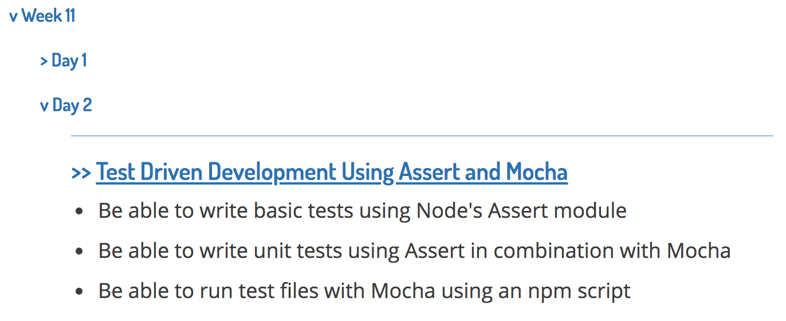

## Introduction

This project delivers our written notes to students. Notes are converted automatically from our `.md` Markdown files into rich HTML with highlighted code blocks and tables of contents. These pages are collected in an easily navigable index, ordered by the week and day of the course in which the lessons were delivered. The site which is generated is then available on Github Pages only to those who have the link (i.e. the students).

This document explains how to use this repo. **It should be deleted before deploying the generated site.**

## At a glance

To display Markdown files properly, the following points need to be met:

* Markdown files should be placed within the `/lessons` directory.
* Markdown files should include [front matter](#front-matter) at the top.
* `gatsby-config.js` should be configured with the current week and day, relative to the cohort.

## Installation

* Install Gatsby CLI: `npm install gatsby-cli`
* Start a Gatsby project, using this starter:
  ```
  gatsby new cohort-name https://github.com/ajrussellaudio/codeclan-notes-starter
  ```
* Run the app locally with `gatsby develop` in Terminal
* Replace the contents of `/lessons` with your [own Markdown](#adding-lessons)

## Deployment

* Create a new private repo on Github, e.g. `e6-notes`
* In `gatsby-config.js`, update the `pathPrefix` field to the name of the repo you just made:

```js
module.exports = {
  // ...
  pathPrefix: '/e6-notes'
  //...
}
```

* Run `npm run deploy`
* Visit the page at https://codeclan.github.io/es6-notes


## Adding lessons

Lessons should be added as Markdown files to the `/lessons` directory.

Folder structure is _not_ important within the `/lessons` directory. _All_ Markdown files will be found, provided they meet the front matter conditions detailed below, regardless of their path within `/lessons`.

```
/lessons/induction.md
/lessons/week_3/day_2/pizza_shop_sql/index.md
/lessons/week_6/day_1/intro_to_java/lesson.md
```

All of these are totally fine; all files will be found. The difference here is in how the URL to these lessons will be generated:

```
https://website.com/e6_classnotes/induction
https://website.com/e6_classnotes/week_3/day_2/pizza_shop_sql
https://website.com/e6_classnotes/week_6/day_1/intro_to_java/lesson
```

Notice that files named `index.md` will not appear in the generated URL, similar to how `index.html` is not required in a web address.

## Front matter

In order to be displayed, Markdown files must include [front matter](http://assemble.io/docs/YAML-front-matter.html) at the top. Front matter is a block of YAML containing metadata about the lesson.

As a minimum, `title`, `week` and `day` fields must be included, for example:

```yaml
---
  title: Intro to Java
  week: 6
  day: 1
---
```

Optionally, an `objectives` field can also be included, which should contain an array of Learning Objectives for the lesson. These will be displayed as a list in the lesson index.

```yaml
---
  title: Test Driven Development Using Assert and Mocha
  week: 11
  day: 2
  objectives: [
    "Be able to write basic tests using Node's Assert module",
    "Be able to write unit tests using Assert in combination with Mocha",
    "Be able to run test files with Mocha using an npm script"
  ]
---
```

Will display in the index:



If no `objectives` field appears in the front matter, the index will display an excerpt of text from the top of the file.

Other fields can be included in the front matter, e.g. `module` and `duration`. These will be ignored by this app, but will still be displayed when viewing the file on Github.

## Configuring the Week and Day

The current week and day for the cohort should be kept up to date in the app's configuration. The app will not display notes with `week` and `day` fields ahead of the week and day that the app is currently configured to.

To update the current week and day, change their values inside `gatsby-config.js`:

```js
// gatsby-config.js
module.exports = {
  siteMetadata: {
    date: {
      week: 2, // INCREASE THIS EVERY WEEK, 1 to 16
      day: 1, // INCREASE EVERY DAY OF WEEK, 1 to 5
    },
    title: "CodeClan",
    // ...
  }
}
```

This means that it is possible to upload an entire week, module or course of notes at once, and then all that needs to be done each night is to update a number, which can be done from Github.

## Code Blocks

The app will display `inline code` using the same style as Slack, to provide some visual unity with how our students communicate.

Code blocks are formatted with a custom style, similar to the Monokai colour scheme found on several text editors. It doesn't suck for colour blindness.

Syntax highlighting depends on denoting the correct language in our lesson notes.

* Strangely, `zsh` is not a valid highlighting language, use `bash`
* React code blocks should use `jsx`
* C# code blocks use `csharp`

The other languages we're interested in should be obvious:

* `ruby`
* `java`
* `javascript` or `js`
* `python`

## Images

Images can be added to notes in the same way as in any other Markdown:

``

URLs can be relative if the image file is added to the `/lessons` directory.

## Instructor notes

Lines in Markdown which start with a `>` character (i.e. block quotes) will not be rendered.

## Technologies used

The main technology used here is [Gatsby](https://www.gatsbyjs.org/), a static site generator built with [React](https://reactjs.org/). Pages are built from standard React components, which pull data from Markdown files stored on the server with [GraphQL](https://graphql.org/). The difference is that rendering takes place on the server, not dynamically on the client. Typographic styling is handled with [Typography.js](https://kyleamathews.github.io/typography.js/). Code formatting is done with [Prism](http://prismjs.com/).
